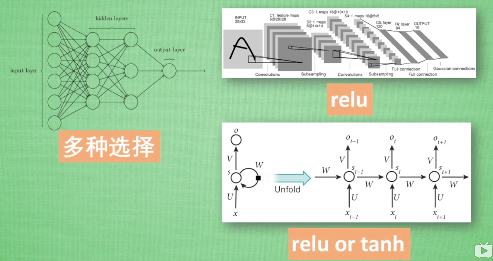

# MorvanTensorflow
莫烦老师的Tensorflow入门教程

## 激励函数(activation function)

> 将原来的线性函数掰弯，从而使得y有了非线性特征

> 前提：激励函数可以微分，因为误差要进行反向传播

类型：

选择：少量层的神经网络中我们可以多种选择，但是层次很多时一定要注意选择，以防梯度爆炸和梯度消失等

在卷积神经网络中我们经常会选择relu，循环神经网络中我们会使用relu或tanh

